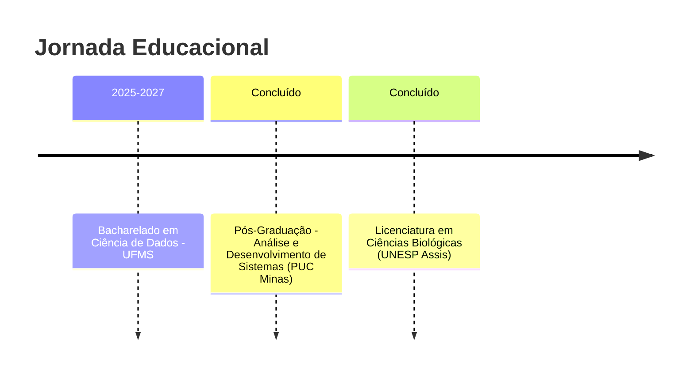

# Danielle Mayumi Tamazato Santos 👩‍💻

<div align="center">

### Transformando Educação em Código | Full Stack Developer | Data Science Student

*"A eficácia da tecnologia reside na clareza com que o conhecimento é compartilhado."*

[](https://www.linkedin.com/in/daniellemtamazato/)
[](mailto:danielle.tamazato@gmail.com)

</div>

---

## 🌟 Sobre Mim

Profissional em transição de carreira que une **+10 anos de experiência no setor educacional** com competências sólidas em **desenvolvimento de software e análise de dados**. Minha missão é criar soluções tecnológicas que sejam tecnicamente robustas e pedagogicamente acessíveis.

Acredito que a melhor tecnologia é aquela que simplifica o complexo e democratiza o conhecimento.

---

## 🚀 Stack Tecnológica

### 💻 Linguagens


### 🎨 Frontend


### ⚙️ Backend & DevOps


### 🌱 Soft Skills
```
🎯 Transposição Didática  |  📊 Gestão Ágil de Projetos  |  ✍️ Revisão Editorial Técnica
```

---

## 🎓 Formação Acadêmica



---

## 💼 Destaques

### 🚀 Atualmente
- 📚 Estudando Ciência de Dados na UFMS
- 💻 Desenvolvendo projetos que unem pedagogia e código
- 🌱 Explorando Machine Learning e suas aplicações educacionais

---

## 💡 Diferenciais

🔹 **Visão Híbrida:** Combino rigor técnico com sensibilidade pedagógica  
🔹 **Comunicação Clara:** Capacidade de traduzir conceitos complexos para diferentes públicos  
🔹 **Aprendizado Contínuo:** Sempre explorando novas tecnologias e metodologias  

---

<div align="center">

### 📫 Vamos Colaborar?

Estou aberta a projetos que unam **tecnologia, educação e impacto social**.

⭐ Se você gostou do meu perfil, considere dar uma estrela nos meus repositórios!

</div>
